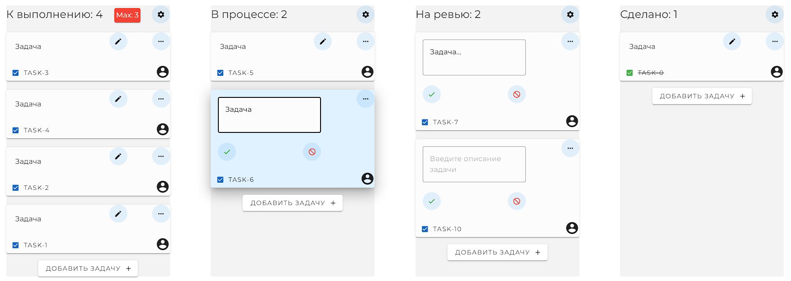

<!-- Improved compatibility of back to top link: See: https://github.com/othneildrew/Best-README-Template/pull/73 -->
<a name="readme-top"></a>
<!--
*** Thanks for checking out the Best-README-Template. If you have a suggestion
*** that would make this better, please fork the repo and create a pull request
*** or simply open an issue with the tag "enhancement".
*** Don't forget to give the project a star!
*** Thanks again! Now go create something AMAZING! :D
-->


<!-- PROJECT SHIELDS -->
<!--
*** I'm using markdown "reference style" links for readability.
*** Reference links are enclosed in brackets [ ] instead of parentheses ( ).
*** See the bottom of this document for the declaration of the reference variables
*** for contributors-url, forks-url, etc. This is an optional, concise syntax you may use.
*** https://www.markdownguide.org/basic-syntax/#reference-style-links
-->

[![Contributors][contributors-shield]][contributors-url]
[![Forks][forks-shield]][forks-url]
[![Stargazers][stars-shield]][stars-url]

[comment]: <> ([![MIT License][license-shield]][license-url])


[comment]: <> (<!-- PROJECT LOGO -->)

[comment]: <> (<br />)

<div align="center">

[comment]: <> (  <a href="https://github.com/B-S-B-Rabbit/KanbanBoard">)

[comment]: <> (    )

[comment]: <> (  </a>)

<h3 align="center">KanbanBoard</h3>

  <p align="center">
    Simple kanban board for your  tasks
    <br />
    <br />
    <a href="https://github.com/B-S-B-Rabbit/KanbanBoard">View Demo</a>
    ·
    <a href="https://github.com/B-S-B-Rabbit/KanbanBoard/issues">Report Bug</a>
    ·
    <a href="https://github.com/B-S-B-Rabbit/KanbanBoard/issues">Request Feature</a>
  </p>
</div>


<!-- TABLE OF CONTENTS -->
<details>
  <summary>Table of Contents</summary>
  <ol>
    <li>
      <a href="#about-the-project">About The Project</a>
      <ul>
        <li><a href="#built-with">Built With</a></li>
      </ul>
    </li>
    <li>
      <a href="#getting-started">Getting Started</a>
      <ul>
        <li><a href="#prerequisites">Prerequisites</a></li>
        <li><a href="#installation">Installation</a></li>
      </ul>
    </li>
    <li><a href="#usage">Usage</a></li>
    <li><a href="#roadmap">Roadmap</a></li>
    <li><a href="#contributing">Contributing</a></li>
    <li><a href="#license">License</a></li>
    <li><a href="#contact">Contact</a></li>
  </ol>
</details>


<!-- ABOUT THE PROJECT -->
## About The Project


A minimalistic and functional kanban Agile project management board that helps you visualize tasks, limit the amount of work in progress, and maximize efficiency. Made via vue3, vuetifyjs and [vuedraggable-next](https://github.com/SortableJS/vue.draggable.next)
<p align="right">(<a href="#readme-top">back to top</a>)</p>


### Built With

[![Vue][Vue.js]][Vue-url]


<p align="right">(<a href="#readme-top">back to top</a>)</p>


<!-- GETTING STARTED -->
## Getting Started

To get a local copy up and running follow these simple example steps.

### Prerequisites

* npm
  ```sh
  npm install npm@latest -g
  ```

### Installation

1. Clone the repo
   ```sh
   git clone https://github.com/B-S-B-Rabbit/KanbanBoard.git
   ```
2. Install NPM packages
   ```sh
   npm install
3. Run the project locally
   ```sh
   npm run serve
---
4. Or build a project
   ```sh
   npm run build
5. Install a static file server Node.js
   ```sh
   npm install -g serve
6. And enter the build preview
    ```sh
   serve -s dist
<p align="right">(<a href="#readme-top">back to top</a>)</p>


<!-- ROADMAP -->
## Roadmap

- [ ] Add pinia or Composition API

See the [open issues](https://github.com/B-S-B-Rabbit/KanbanBoard/issues) for a full list of proposed features (and known issues).

<p align="right">(<a href="#readme-top">back to top</a>)</p>


<!-- CONTRIBUTING -->
## Contributing

Contributions are what make the open source community such an amazing place to learn, inspire, and create. Any contributions you make are **greatly appreciated**.

If you have a suggestion that would make this better, please fork the repo and create a pull request. You can also simply open an issue with the tag "enhancement".
Don't forget to give the project a star! Thanks again!

1. Fork the Project
2. Create your Feature Branch (`git checkout -b feature/AmazingFeature`)
3. Commit your Changes (`git commit -m 'Add some AmazingFeature'`)
4. Push to the Branch (`git push origin feature/AmazingFeature`)
5. Open a Pull Request

<p align="right">(<a href="#readme-top">back to top</a>)</p>


<!-- LICENSE -->
## License

Distributed under the MIT License. See `LICENSE.txt` for more information.

<p align="right">(<a href="#readme-top">back to top</a>)</p>


<!-- CONTACT -->
## Contact

Andrew - [@ddanvers](https://t.me/ddanvers) - telegram

Project Link: [https://github.com/B-S-B-Rabbit/KanbanBoard](https://github.com/B-S-B-Rabbit/KanbanBoard)

<p align="right">(<a href="#readme-top">back to top</a>)</p>

<!-- MARKDOWN LINKS & IMAGES -->
<!-- https://www.markdownguide.org/basic-syntax/#reference-style-links -->
[contributors-shield]: https://img.shields.io/github/contributors/B-S-B-Rabbit/KanbanBoard.svg?style=for-the-badge
[contributors-url]: https://github.com/B-S-B-Rabbit/KanbanBoard/graphs/contributors
[forks-shield]: https://img.shields.io/github/forks/B-S-B-Rabbit/KanbanBoard.svg?style=for-the-badge
[forks-url]: https://github.com/B-S-B-Rabbit/KanbanBoard/network/members
[stars-shield]: https://img.shields.io/github/stars/B-S-B-Rabbit/KanbanBoard.svg?style=for-the-badge
[stars-url]: https://github.com/B-S-B-Rabbit/KanbanBoard/stargazers
[issues-shield]: https://img.shields.io/github/issues/B-S-B-Rabbit/KanbanBoard.svg?style=for-the-badge
[issues-url]: https://github.com/B-S-B-Rabbit/KanbanBoard/issues
[license-shield]: https://img.shields.io/github/license/B-S-B-Rabbit/KanbanBoard.svg?style=for-the-badge
[license-url]: https://github.com/B-S-B-Rabbit/KanbanBoard/blob/master/LICENSE.txt
[linkedin-shield]: https://img.shields.io/badge/-LinkedIn-black.svg?style=for-the-badge&logo=linkedin&colorB=555
[linkedin-url]: https://linkedin.com/in/linkedin_username
[product-screenshot]: images/screenshot.png
[Vuetifyjs]: 
[Vuetifyjs-url]: https://vuetifyjs.com/
[Vue.js]: https://img.shields.io/badge/Vue.js-35495E?style=for-the-badge&logo=vuedotjs&logoColor=4FC08D
[Vue-url]: https://vuejs.org/
